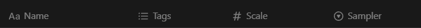

# Novelai To Notion

使用 telegra.ph 作为图床将在 novelai.net 中生成的图片依据 metadata 在指定 Notion 数据库中生成特定格式的 Page

## 请注意

- 目前使用 telegra.ph 当作图床，请注意不要滥用并且不要泄露隐私信息
- 目前生成 Page 的 properties 和 content 是写死的，格式在最底下
- 图片所有的相关生成参数都在 Page 里，图片中还存有原始 metadata
- 有需要可以提出来，看需求和时间我尝试写一些 :d

## 使用方法

### 安装插件

zip 在 `dist-zip` 下

### 获取 Notion integration auth key

[src](https://www.notion.so/my-integrations)

internal 即可，应用名什么的随意，重要的是 key

权限细节不清楚，有闲心的可以慢慢试，我是除了 user info 拉满的

### 获取想要存入的 Notion 数据库 id

[doc](https://developers.notion.com/reference/retrieve-a-database)

文中链接可以在网页上打开相应数据库页面获得，**注意要是数据库页面而不是套着一个数据库 View 的父页面**

### 授予 integration 上面所选的 Notion 数据库的访问权限

[doc](https://www.notion.so/help/add-and-manage-connections-with-the-api#add-connections-to-pages)

### 在扩展的设置页面填入相应数据

在扩展图标上 鼠标右键 -> 扩展选项

在扩展管理页面 详细信息 -> 扩展选项

以上在 Edge 上实验

### 点击 submit 提交至扩展

如果成功，下面应该会以 json 形式显示数据库的 schema

### 发送图片

在 `https://novelai.net/image` 页面生成图片后，下方会出现一个 **N** 形状的按钮，按它

注意被发送到 Notion 的图片是你屏幕中间显示的，所以可以通过右侧的历史记录发送之前生成的图片

## 数据库格式要求

在这个时间(`2024-04-06 02:23:13`),会被自动赋值的有 4 个列名和对应上的列类型

- `Name` : `title` (默认的标题属性) -> 图片的 `signed_hash` 值
- `Tags` : `multi_select` (多选) -> 图片以 `artist:` 开头或是转成小写时在列表 `nsfw,` 中的 prompt
- `Scale` : `number` (数字)
- `Sampler` : `select` (单选)

名字或是类型对应不上的都不会进行赋值(个人而言最有用的也就这几个了吧)
